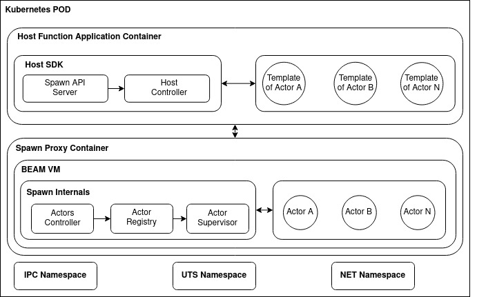

# Architecture

Spawn takes the Actor Model's distribution, fault tolerance, and high concurrent capability in
its most famous implementation, the BEAM Erlang VM implementation, and adds to the
flexibility and dynamism that the sidecar pattern offers to build cross-platform and polyglot
microservice-oriented architectures.

To achieve these goals, the Eigr Functions Spawn architecture is composed of the following components:

As seen above, the Eigr Functions Spawn platform architecture is separated into different components, each with its responsibility. We will detail the components below.

- **k8s Operator:** Responsible for interacting with the Kubernetes API and coordinating the deployments of the other components. The user interacts with it using our specific CRDs ([Custom Resource Definitions](https://kubernetes.io/docs/concepts/extend-kubernetes/api-extension/custom-resources/)). We'll talk more about our CRDs later.

- **Cloud Storage:** Despite not being directly part of the platform, it is worth mentioning here that Spawn uses user-defined persistent storage to store the state of its Actors. Different types of persistent storage can be used, such as relational databases such as MySQL, Postgres, among others. In the future, we will support other types of databases, both relational and non-relational.

- **Activators:** Activators are applications responsible for ingesting data from external sources for certain user-defined actors and are configured through their own CRD. They are responsible for listening to a user-configured event and forward this event through a direct invocation to a specific target actor. Different types of Activators exist to consume events from other providers such as Google PubSub, RabbitMQ, Amazon SQS, etc.

- **Actor Host Function:** The container where the user defines his actors and all the business logic of his actors around the state of these actors through a specific SDK for each supported programming language.

- **Spawn Sidecar Proxy:** The centerpiece of the gear is our sidecar proxy; in turn it is responsible for managing the entire lifecycle of user-defined actors through our SDKs and also responsible for managing the state of these actors in persistent storage. The Spawn proxy can also allow the user to develop different integration flows between its actors such as Forwards,
  Effects, Pipes, and in the future, other essential standards such as Saga, Aggregators, Scatter-
  Gather, external invocations, and others.
  Our proxy connects directly and transparently to all cluster members without needing for a single point of failure, i.e., a true mesh network.

As we use Kubernetes to orchestrate our workloads through our Operator each user application will be summarized at the end there is a POD which is the smallest measure of workload present in kubernetes. Below is an image of how the components are grouped inside a POD in Kubernetes:

In turn, each Sidecar container within a POD organizes itself to form an Erlang cluster for each ActorSystem. Different ActorSystems can coexist in the same Kubernetes cluster and these in turn communicate cross ActorSystem using a Nats Broker as a transport mechanism via message passing. In this way we can granulate a large system into smaller parts, forming small Erlang clusters that still manage to maintain the behavior of a larger cluster depending on how the developer organizes its deployable units.

[Next: Conceptual](conceptual.md)

[Previous: Overview](overview.md)